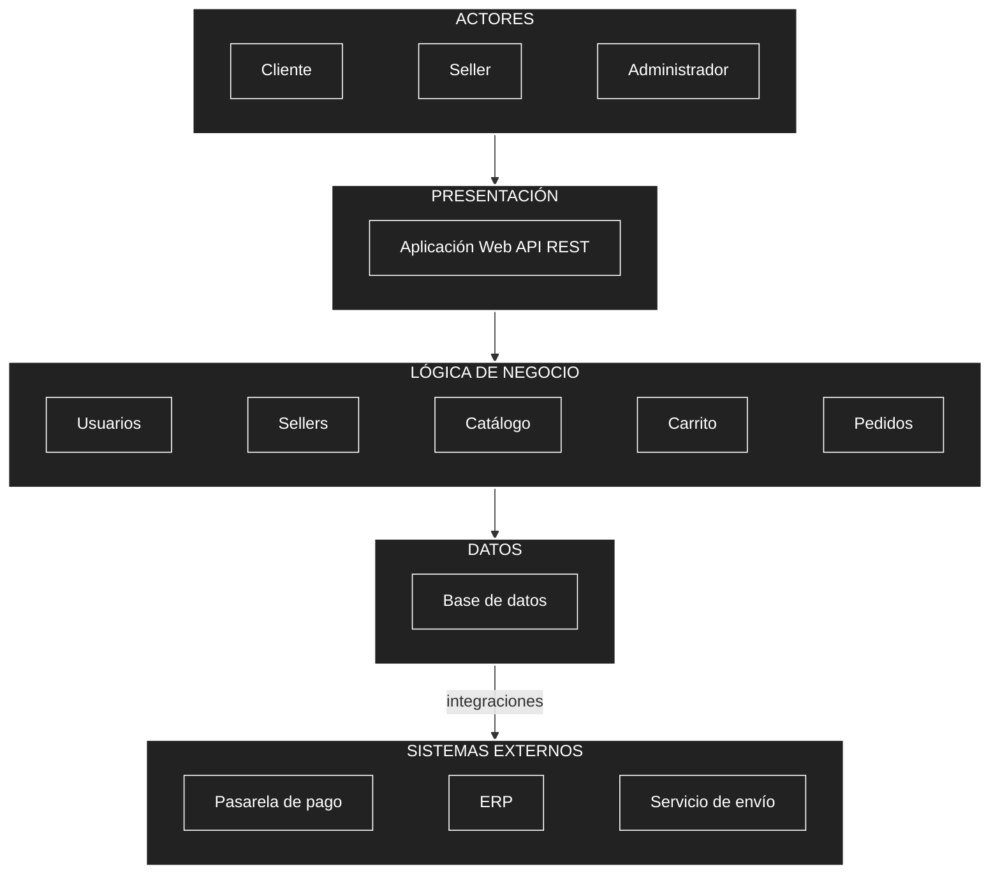

# Arquitectura inicial del sistema

## Diagrama de arquitectura

## Descripción

La arquitectura inicial se organiza en tres capas principales[cite: 1]:

* **Presentación:** Permite la interacción de los usuarios con el sistema mediante la aplicación web y la API REST[cite: 1].
* **Lógica de negocio:** Contiene los principales módulos responsables de las funcionalidades del sistema: usuarios, sellers, catálogo, carrito y pedidos[cite: 1].
* **Datos:** Permite almacenar y consultar la información mediante una base de datos[cite: 1].

Además, el módulo de **Pedidos** se integra con sistemas externos como la **pasarela de pago**, el **ERP** y el **servicio de envío**[cite: 1].